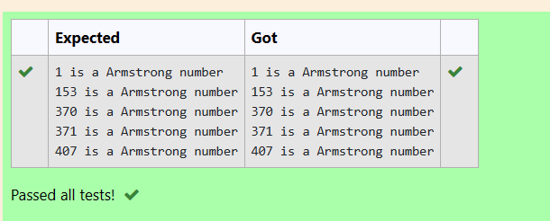
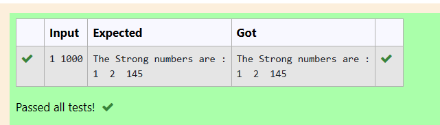

# # EX3(B)Looping
Developed by: ARSHITHA MS

Register number: 212223240015
 ## AIM:
 To write a program to print armstrong numbers and strong numbers for a given range.

 ## ALGORITHM:
 1.Start the program

 2.Declare the variables

 3.Get input from the user.

 4.Use while loop or for loop.
 
 5.Print the output.

 6.End the program

 
 ## PROGRAM
 ### Program 1(Armstrong Number):
 ```
 #include<stdio.h>  
int main()  
{  
    int num,i = 1, rem, sum;  
    while(i <= 500)  
    {  
        num = i;  
        sum = 0;  
        while(num)  
        {  
            rem = num % 10;  
            sum = sum + (rem * rem * rem);  
            num = num / 10;  
        }  
  
        if(i == sum)  
        {  
            printf("%d is a Armstrong number\n", i);  
        }  
  
        i++;  
    }  
  
     return 0;  
}  
```
### Program 2(Strong Numbers):
```
#include <stdio.h>
int main()
{
    int n1,n2,i,sum,r,j,k;
    scanf("%d %d",&n1,&n2);
    printf("The Strong numbers are :\n");
    for(i=n1;i<=n2;i++)
    {
        r=i;
        sum=0;
        for(j=i;j>0;j=j/10)
        {
            int fact=1;
            for(k=1;k<=j%10;k++)
            {
                fact=fact*k;
            }
            sum+=fact;
        }
        if(sum==r)
        printf("%d  ",r);
        
    
    }
    printf("\n");
    return 0;
    
    
}
```

## OUTPUT:
### Output 1:



### Output 2:


## RESULT:
Thus the program to print armstrong numbers and strong numbers for a given range is executed successfully.
